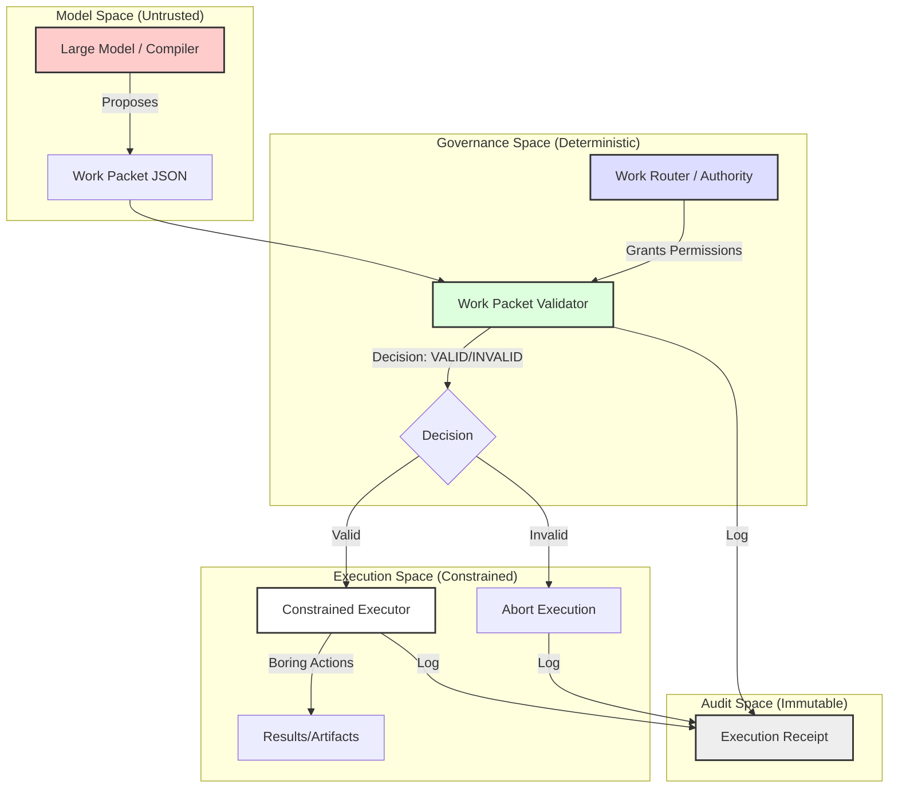

# Architecture Diagram: Work Packet Compiler

This diagram describes the "Governed Delegation" flow.

## Mermaid.js Flow

## Component Descriptions

1. **Large Model (Compiler)**: Proposes a structured plan. It has no inherent authority to execute.
2. **Work Router**: The source of truth for what is *allowed* on the system. It manages the a-priori permission set.
3. **Work Packet Validator**: The gatekeeper. It compares the model's proposal against the Router's policy. It catches privilege escalation, forbidden actions, and dishonesty.
4. **Constrained Executor**: Performs only the specific, validated actions. It does not "reason"; it only executes.
5. **Execution Receipt**: An audit trail that proves the delegation chain. It records exactly which permissions were granted and where the process stopped.

## The Proof Path
**Proposal** $\rightarrow$ **Authorization** $\rightarrow$ **Execution** $\rightarrow$ **Audit**.
